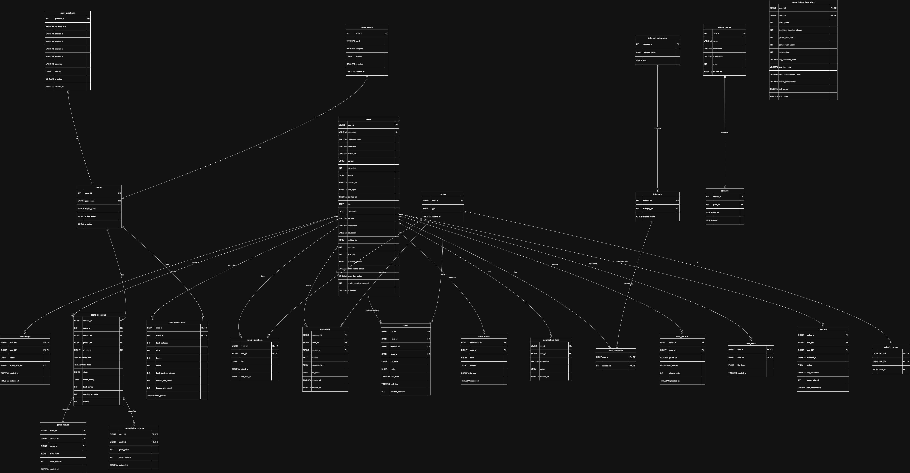

# GAMEFRIENDZONE - Mạng Xã Hội & Game Đa Năng

<div align="center">
  
  
  
  
  
  
</div>

## Mục Lục
- [Giới Thiệu](#giới-thiệu)
- [Tính Năng Chính](#tính-năng-chính)
- [Kiến Trúc Hệ Thống](#kiến-trúc-hệ-thống)
- [Cài Đặt & Chạy](#cài-đặt--chạy)
- [Cấu Trúc Dự Án](#cấu-trúc-dự-án)
- [Giao Diện](#giao-diện)
- [Bảo Mật](#bảo-mật)
- [Hiệu Suất](#hiệu-suất)
- [Đóng Góp](#đóng-góp)
- [Giấy Phép](#giấy-phép)
- [Liên Hệ](#liên-hệ)

---

## Giới Thiệu

> **GAMEFRIENDZONE** là một nền tảng mạng xã hội kết hợp game đa năng được phát triển bằng Java, mang đến trải nghiệm giải trí toàn diện cho người dùng. Dự án kết hợp mô hình Client-Server với Peer-to-Peer để đảm bảo hiệu suất cao cho các tính năng thời gian thực.

### Mục Tiêu Dự Án
- Tạo nền tảng mạng xã hội thân thiện cho giới trẻ
- Cung cấp đa dạng game giải trí
- Hỗ trợ giao tiếp thời gian thực (chat, voice, video)
- Quản lý hồ sơ cá nhân và kết nối bạn bè

## Tính Năng Chính

### Mạng Xã Hội
- **Đăng ký/Đăng nhập** an toàn với mã hóa SSL
- **Hồ sơ cá nhân** với avatar và thông tin chi tiết
- **Kết nối bạn bè** với hệ thống matching thông minh
- **Chat nhóm và riêng tư** với stickers
- **Video call** và **voice chat** thời gian thực

### Game Đa Dạng
- **Caro** - Game cờ vua Việt Nam
- **Catch Heart** - Game bắt tim lãng mạn
- **Draw & Guess** - Vẽ và đoán từ
- **Love Quiz** - Trắc nghiệm tình yêu
- **Word Chain** - Nối từ thông minh

### Công Nghệ
- **Backend**: Java Multi-threading Server
- **Frontend**: Java Swing GUI
- **Database**: MySQL với connection pooling
- **Network**: TCP/UDP sockets, Multicast
- **Security**: SSL/TLS encryption
- **Media**: Webcam capture, Audio processing

## Kiến Trúc Hệ Thống

<div align="center">
  
</div>

### ERD Database
<div align="center">
  
</div>

### Sequence Diagram
<div align="center">
  
</div>

## Cài Đặt & Chạy

### Yêu Cầu Hệ Thống
- **Java**: JDK 21 LTS trở lên
- **MySQL**: Version 8.0+
- **RAM**: Tối thiểu 4GB
- **OS**: Windows/Linux/MacOS

### Chuẩn Bị Database
1. Cài đặt MySQL Server
2. Tạo database và import schema:
```bash
mysql -u root -p < database.sql
```

### Build Dự Án
```bash
# Download dependencies
download_libs.bat

# Build project (sử dụng NetBeans hoặc Ant)
ant -f build.xml
```

### Chạy Ứng Dụng
```bash
# Chạy Server
run_server.bat

# Chạy Client (có thể chạy nhiều instance)
run_client.bat
```

---

## Cấu Trúc Dự Án

<details>
<summary>Nhấn để xem cấu trúc chi tiết</summary>

```
GAMEFRIENDZONE/
├── src/
│   ├── com/friendzone/
│   │   ├── client/
│   │   │   ├── audio/          # Xử lý âm thanh
│   │   │   ├── controller/     # Logic điều khiển client
│   │   │   ├── video/          # Xử lý video
│   │   │   └── view/           # Giao diện người dùng
│   │   ├── dao/                # Data Access Objects
│   │   ├── model/              # Model classes
│   │   ├── server/             # Server logic
│   │   └── util/               # Utilities
│   └── gamefriendzone/         # Legacy code
├── lib/                        # Dependencies
├── hinh/                       # Stickers & images
├── HÌNH/                       # Documentation diagrams
├── nbproject/                  # NetBeans project files
├── build.xml                   # Ant build script
├── manifest.mf                 # JAR manifest
├── database.sql                # Database schema
├── *.bat                       # Run scripts
└── README.md                   # This file
```

</details>

---

## Giao Diện

<div align="center">
  
</div>

### Screenshots
- **Login Screen**: Đăng nhập an toàn
- **Lobby**: Phòng chờ với danh sách bạn bè
- **Game Rooms**: Các phòng game đa dạng
- **Chat Interface**: Giao tiếp với stickers

---

## Bảo Mật

- **SSL/TLS**: Mã hóa kết nối client-server
- **Password Hashing**: SHA-256 với salt
- **Input Validation**: Ngăn chặn SQL injection
- **Session Management**: Quản lý phiên làm việc

---

## Hiệu Suất

- **Concurrent Users**: Hỗ trợ 100+ users đồng thời
- **Latency**: < 100ms cho real-time features
- **Scalability**: Modular architecture cho mở rộng
- **Resource Usage**: Optimized cho low-end hardware

---

## Đóng Góp

Chúng tôi hoan nghênh mọi đóng góp! 

### Cách Đóng Góp
1. Fork repository
2. Tạo feature branch: `git checkout -b feature/AmazingFeature`
3. Commit changes: `git commit -m 'Add AmazingFeature'`
4. Push to branch: `git push origin feature/AmazingFeature`
5. Tạo Pull Request

### Báo Lỗi
- Sử dụng GitHub Issues
- Mô tả chi tiết lỗi và cách reproduce
- Đính kèm screenshots nếu có

## Giấy Phép

Dự án này được phân phối dưới giấy phép MIT. Xem file `LICENSE` để biết thêm chi tiết.

## Tác Giả

- **Developer**: Lê Hoàng
- **Project**: GAMEFRIENDZONE
- **Version**: 2.5 Final

## Liên Hệ

- **Email**: le294594@gmail.com
- **GitHub**: [Visin-8386](https://github.com/Visin-8386)


---

<div align="center">
  <p>Made with love by GAMEFRIENDZONE Team</p>
  <p>Star us on GitHub if you like this project!</p>
</div></content>
